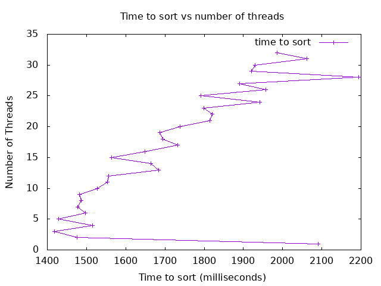

## Analysis

### Graph

### Discussion

In this project, I worked on improving a mergesort algorithm by making it multi-threaded, which means it can use more than one part of the CPU at a time to sort faster. I tested it with different numbers of threads to see how the sorting time changed. The goal was to get a graph that looked like the example given, but my results were a bit different.

My graph shows the time it takes to sort as I increase the number of threads. In the example, the graph starts with fast sorting, then becomes steady, and eventually gets slower as more threads are added. 

In my graph, the sorting time goes up and down a lot and doesn’t look as smooth. This might be because my computer has different hardware, the fact I was using Codespaces to run it, or just because there’s extra work needed to manage the threads as they increase. In the beginning, adding more threads did help make sorting faster. But as the thread count got higher, the sorting time didn’t get better. Instead, it started to get slower or stayed the same. This is shown by the fact that starting at 1 thread was about 2100 milliseconds, while 2 threads was only a bit lower than 1500 milliseconds. This is a big change! It seems to look like at about 10 or so threads is when the results start getting worse. This is because a computer can only handle so many threads before it has to start “switching” between them, which takes time.

The best number of threads for my computer was between 2 and 6 threads. In this range, sorting time was the lowest because the workload was shared without too much extra work. The slowest sorting times happened at high thread counts, like 27 to 32 threads. At this point, my computer had to work hard to manage all the threads, and this took time away from the sorting itself. This led to slower sorting, even though I was using a lot of threads. Each thread has its own setup and communication costs, and beyond a certain number, these costs make it harder for the threads to work efficiently together. My graph shows this clearly, where the sorting time becomes inconsistent or even increases after a certain point. This effect is especially visible in multi-threaded programs that are limited by available CPU, meaning more threads do not necessarily result in faster execution.

The difference between my graph and the example might be due to a few reasons. One reason could be that my merge sort isn’t perfectly optimized for multiple threads. For example, the merging part of the sort might have created some bottlenecks, where threads had to wait for each other.

Another reason could be that my computer’s hardware is different from what the example was tested on. Things like the number of CPU cores and how the CPU manages threads can impact the results.

Even though my program worked, the way sorting time changed shows that managing threads can be tricky. I checked for bugs, like memory leaks or too much synchronization, but didn’t find anything major. I don't believe there is a bug in my mergesort_mt code, but maybe there would be a way to optimize it so it looks like the example.

